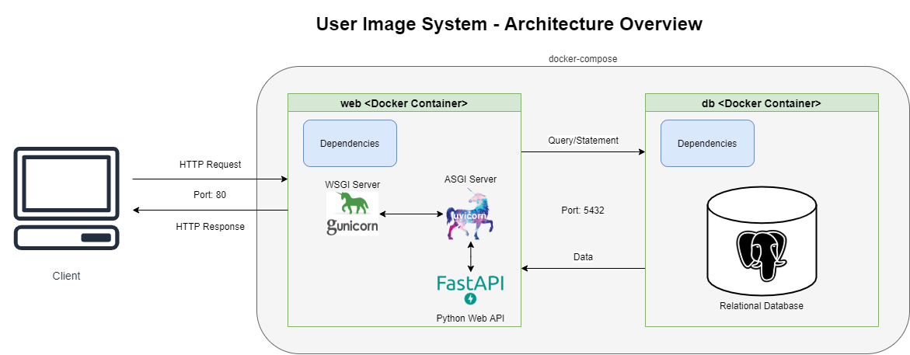
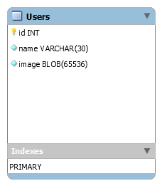

# Desafio Banco do Brasil: User Image System
- Autor: Rodrigo Touriño Machado de Oliveira Lima
- Data: 2021-05-02

## Descrição

API para gerenciar imagens de usuários desenvolvida com FastAPI, PostgreSQL e Docker.

## Instruções para uso

1. Baixe o repositório:

```sh
$ git clone https://github.com/rodrigotlima/desafio-bb.git
```

2. No diretório raiz que contém o arquivo `docker-compose.yml`, construa as imagens e rode os containers:

```sh
$ docker-compose up -d --build
```

3. Para verificar a documentação Swagger gerada automaticamente, acesse o endereço [http://localhost/docs](http://localhost/docs) 

4. Para testar a aplicação:

```sh
$ docker exec -t <nome_do_container_web> pytest
```

## Arquitetura da Solução



## Diagrama Entidade-Relacionamento


